# AI Visibility Evidence Loop

## Product promise

For the buyer questions that matter, AnswerLint shows whether a brand is
represented accurately, which sources shape the answer, and the smallest
evidence-backed change that can improve a high-stakes decision.

Phase 1 proves one controlled surface well. Multi-provider comparison and
longitudinal tracking are Phase 2 and must remain separate measurement lanes.

## Why this product exists

Visibility charts answer “was the brand mentioned?” but leave a leadership
team to decide whether the answer is accurate, whether its citations support
the brand's claims, which page should change, who owns it, and how the team will
know the change helped. AnswerLint turns that gap into an auditable decision
loop without claiming causal revenue attribution.

The core objects are:

1. an approved entity and brand-voice claim;
2. an editable, discardable cohort of real buyer questions;
3. repeatable provider runs with retained answers and source manifests;
4. independent URL and claim-support verification;
5. a bounded CrewAI interpretation with exact evidence references;
6. page-linked actions with an owner, business-value hypothesis, acceptance
   criteria, cost of inaction, and locked-cohort re-test.

## Execution boundary

```mermaid
flowchart LR
  A["Human-approved brand and prompts"] --> B["Inngest durable benchmark"]
  B --> C["Provider adapter"]
  C --> D["Immutable answer and citation evidence"]
  D --> E["Independent source and claim verification"]
  E --> F["Signed private CrewAI Flow"]
  F --> G["Schema and evidence-reference release gate"]
  G --> H["CEO, CFO, product and marketing decisions"]
  H --> I["Human-owned page change"]
  I --> J["Locked-cohort re-test"]
```

Inngest and Supabase own execution and facts. CrewAI is the interpretation
foundation: its Flow validates input, its sequential Crew analyzes evidence,
protects brand voice, plans actions, and performs a safety review. The crew has
no browser, publishing, filesystem, CRM, email, or shell tools.

## Decision contract

A recommendation is promoted only when it contains:

- the affected prompt IDs and actual run IDs;
- only source URLs present in the signed evidence package;
- a supplied owned target page;
- confidence and high-stakes priority;
- the customer pain as `observed` or explicitly `inferred`;
- a CEO, CFO, product, or marketing decision lens;
- a qualitative value hypothesis tied to demand capture, conversion,
  retention, trust, or risk reduction;
- cost of inaction without fabricated financial amounts;
- concrete completion criteria and a comparable re-test rule.

Revenue remains a hypothesis until the company connects its own funnel or CRM
outcome data. A change in AI visibility is never presented as proof of revenue.

## Competitive product principles

Use the clarity of Amplitude-style evidence drill-downs and the prompt/source
monitoring expected from AI visibility products, but make the differentiator
the verified transition from evidence to action:

- claim-level brand-voice fidelity, not sentiment alone;
- approval and discard controls before calls cost money;
- exact evidence provenance on every executive insight;
- page-level acceptance criteria instead of generic content advice;
- an explicit cost-of-inaction and value hypothesis for prioritization;
- deterministic metrics separated from agent interpretation;
- a locked cohort for honest before/after evaluation.

## Deployment sequence

1. Run `supabase/visibility.sql` to add prompt inclusion, progress, and the
   separate CrewAI analysis table.
2. Deploy `services/visibility-crew/Dockerfile` behind an authenticated private
   ingress and configure its `ANSWERLINT_CREW_*` variables.
3. Configure the matching `VISIBILITY_CREW_*` variables in Vercel. Start with
   `best_effort`; move to `required` after health checks and alerts are proven.
4. Redeploy the Next.js/Inngest app and resync `/api/inngest`.

The Inngest route uses response streaming, a 300-second Vercel duration, and a
240-second checkpoint window. Provider calls default to a 120-second timeout,
which stays below that execution ceiling and produces a terminal failure state
instead of an indefinite spinner.
5. Create a new workspace, approve its brand claim, edit/discard prompts, lock
   the cohort, and run the controlled benchmark.

The service signs the timestamp, request ID, and exact body with HMAC-SHA256,
enforces a short replay window and per-instance replay guard, validates strict
input/output schemas, caps request size and concurrency, and suppresses model
errors from customer responses.

## Phase 2

Add provider adapters behind the existing surface registry. Do not merge native
consumer observations, controlled APIs, site readiness, or hypotheses into one
percentage. Add immutable benchmark cohort IDs before enabling schedules, so
every trend and re-test can resolve to the exact prompt, runtime, policy, answer,
and source set used at that time.
